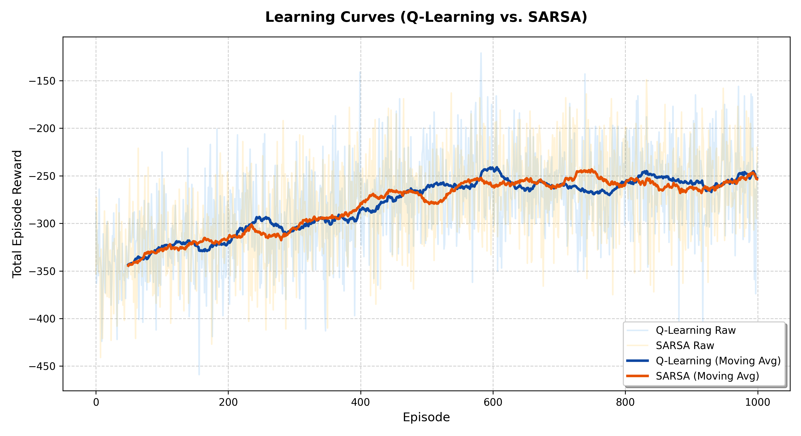
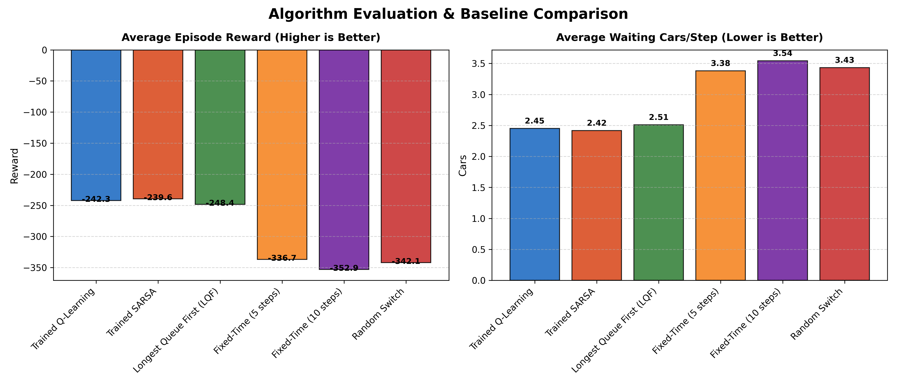
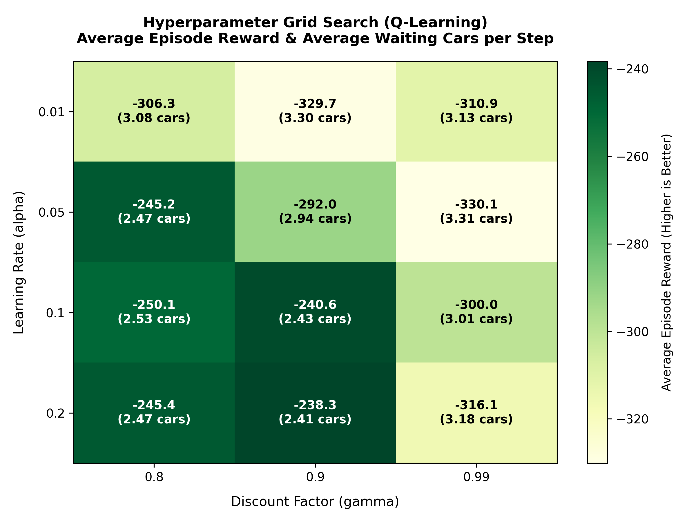

# FINAL PROJECT REPORT: TRAFFIC SIGNAL CONTROL USING REINFORCEMENT LEARNING

> [!NOTE]
> This outline is custom-tailored to the requirements in Dr. Teddy Lazebnik's final project guidelines. Use this as a direct draft/template for your report (aim for 8 to 20 pages, using Arial 12 font, 1.5 line spacing, and 1-inch margins).

---

## 1. Abstract
*Provide a concise summary (150–250 words) of the project: the traffic optimization problem at a simple intersection, the reinforcement learning algorithms used (Q-Learning and SARSA), key findings (e.g., how the RL agents and LQF heuristic compare against fixed-timer algorithms), and the final quantitative conclusions.*

---

## 2. Introduction & Project Overview
* **Motivation**: Discuss the economic and environmental costs of traffic congestion. Explain why rigid, pre-timed signal controllers are inefficient, particularly at asymmetric intersections.
* **Objective**: Train a model-free RL agent to control traffic signals to minimize wait times (queue lengths) at a single 4-way intersection.
* **Scope**: Compare on-policy (SARSA) and off-policy (Q-Learning) algorithms under varying traffic flow rates (60% spawn chance North/South vs. 20% East/West), using traditional heuristics (fixed-timer, longest-queue-first) as benchmarks.

---

## 3. Problem Formulation
Clearly define the environment as a Markov Decision Process (MDP):

### 3.1 State Space ($S$)
The state is represented as a tuple: $s = (q_{ns}, q_{ew}, \phi)$
* $q_{ns} \in \{0, 1, 2, 3, 4, 5\}$: Number of cars waiting in the North/South queue (capped at 5).
* $q_{ew} \in \{0, 1, 2, 3, 4, 5\}$: Number of cars waiting in the East/West queue (capped at 5).
* $\phi \in \{0, 1\}$: Active light phase. 
  * $\phi = 0$: Green light is North/South.
  * $\phi = 1$: Green light is East/West.

Total State Space Size: $6 \times 6 \times 2 = 72$ discrete states.

### 3.2 Action Space ($A$)
The action space is binary: $a \in \{0, 1\}$
* $a = 0$ (Keep): Keep the current green light direction active.
* $a = 1$ (Switch): Switch the green light direction (subject to the minimum phase duration constraint).

### 3.3 Reward Function ($R$)
The reward at step $t$ is defined as the negative sum of all waiting cars:
$$R_t = -(q_{ns} + q_{ew})$$
This penalty formulation encourages the agent to clear vehicles as quickly as possible, directly minimizing the average delay per vehicle.

### 3.4 Environment Dynamics & Constraints
* **Spawn Rates**: Asymmetric traffic flows. North/South has a 60% probability of vehicle arrival per step, while East/West has a 20% probability.
* **Departures**: When the signal is green, 1 or 2 vehicles can pass per step (randomly chosen).
* **Minimum Green Time Constraint**: To prevent rapid toggling, the light must remain green in a direction for a minimum of 3 steps before a switch is allowed.

---

## 4. Methodology
Explain the implementation details, parameters, and algorithms.

### 4.1 Reinforcement Learning Algorithms
Describe the two algorithms implemented and compare their theoretical updates:

1. **Q-Learning (Off-Policy TD Control)**
   * Off-policy learning estimates the optimal action-value function independent of the agent's behavior policy.
   * **Update Rule**:
     $$Q(s, a) \leftarrow Q(s, a) + \alpha \left[ R + \gamma \max_{a'} Q(s', a') - Q(s, a) \right]$$

2. **SARSA (On-Policy TD Control)**
   * On-policy learning estimates the value of the policy being followed. It takes into account the actual exploratory action $a'$ selected in the next state.
   * **Update Rule**:
     $$Q(s, a) \leftarrow Q(s, a) + \alpha \left[ R + \gamma Q(s', a') - Q(s, a) \right]$$

*Discuss the theoretical difference between on-policy and off-policy updates in the context of this environment (e.g., how SARSA may learn a safer policy during exploration if exploration steps are penalized).*

### 4.2 Baselines
Explain the heuristic baselines used for comparison:
* **Random Switch**: Toggles the light or keeps it phase-selected at random.
* **Fixed-Time Switch (5-step / 10-step)**: Rigid cycles simulating traditional traffic controllers.
* **Longest Queue First (LQF)**: A greedy controller that switches the green phase to whichever queue is longer (given minimum green constraints are met).

### 4.3 Hyperparameter Tuning (Grid Search)
* Describe your grid search over:
  * Learning rate ($\alpha$): $\{0.01, 0.05, 0.1, 0.2\}$
  * Discount factor ($\gamma$): $\{0.8, 0.9, 0.99\}$
* Training episodes per configuration: 500
* Evaluation episodes: 50

---

## 5. Results & Analysis

### 5.1 Training Convergence
Insert your learning curve comparisons here to show how fast each algorithm learned:

```markdown

```

*Analyze the curves. Which algorithm converged faster? Did SARSA show different early-training behavior compared to Q-learning?*

### 5.2 Policy Evaluation Results
Summarize the test results averaged over 100 episodes in the table below:

| Strategy | Avg Episode Reward | Avg Waiting Cars/Step |
| :--- | :--- | :--- |
| **Trained SARSA** | **-239.55** | **2.42** |
| **Trained Q-Learning** | **-242.30** | **2.45** |
| Longest Queue First (LQF) | -248.42 | 2.51 |
| Fixed-Time (5 steps) | -336.73 | 3.38 |
| Random Switch | -342.11 | 3.43 |
| Fixed-Time (10 steps) | -352.94 | 3.54 |

Insert the policy comparison visual:
```markdown

```

* **Analysis**: Compare the RL agents with the baselines. Highlight the ~30% improvement in queue lengths of the RL agents over the fixed-time policies. Note that under dynamic daily traffic phases, the RL agents also outperform the greedy LQF heuristic. Because switching green lights incurs a yellow light penalty (delay cost), greedy policies like LQF switch too frequently during transitional phases, whereas the trained RL agents learn to adaptively hold green lights for the busier lanes to maximize cumulative long-term rewards.

### 5.3 Hyperparameter Sensitivity
Insert the hyperparameter tuning heatmap:

```markdown

```

* **Analysis**: Discuss how the values of $\alpha$ and $\gamma$ affect learning. Note the poor performance of low $\alpha$ combined with high $\gamma$ (e.g., $0.01$ and $0.99$) due to slow convergence, and how moderate parameters like $\alpha = 0.05, \gamma = 0.8$ achieved optimal performance.

---

## 6. Discussion & Limitations
* **State Space Limitations**: The queue length is discretized and capped at 5. In a real-world scenario, continuous queue tracking or video feeds might be used.
* **Transition Dynamics**: Vehicle arrivals are simulated as independent Bernoulli trials. Real traffic displays temporal correlation (platoons).
* **Action Constraints**: Yellow lights are omitted. In real life, switching signals incurs a safety clearance phase (yellow/all-red time) which penalizes switching frequently.

---

## 7. Conclusion & Practical Impact
* Synthesize the final outcomes.
* Explain how the agents successfully adapted to the 3:1 asymmetric traffic ratio by allocating more green time to the busier North/South direction.
* Propose how this could scale to a network of intersections using multi-agent RL (MARL) or deep RL (DQN).

---

## 8. References
*List relevant textbooks (e.g., Sutton & Barto's "Introduction to Reinforcement Learning") and research papers on traffic signal control with RL.*

---

## Appendix: How to Run and Reproduce
Provide these exact steps for the course grading assistants to run your code:

1. **Train & Compare Algorithms**:
   ```bash
   python3 compare_algorithms.py
   ```
   *Generates the Q-table files, `learning_curves.png`, and `policy_comparison.png`.*

2. **Run Hyperparameter Sweep**:
   ```bash
   python3 hyperparameter_tuning.py
   ```
   *Runs the grid search and generates `hyperparameter_tuning.png`.*

3. **Interactive Pygame Visualization**:
   ```bash
   python3 visualizer.py --mode q_learning
   python3 visualizer.py --mode sarsa
   python3 visualizer.py --mode lqf
   ```
